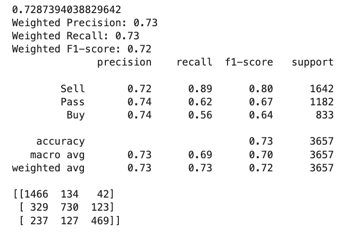

# __OptyX: Machine Learning__

The proprietary OptyX technology implements machine learning as a means of predicting the percent profit or loss of a weekly call option's contract at two days until expiration using option contract variables (present call option price, strike price, underlying asset price, the Greeks, implied volatility, and volume), along with VIX prices, inflation percent, and various sentiment metrics. The predicted profit or loss, the 'y' outcome, is classified into the following three classes: ['0'] a loss of a contract's value greater than 30%, which constitutes a "Sell to Open" recommendation, ['1'] a change in a contract's value between -30% and 25%, which constitutes a "Pass" recommendation, and finally ['2'] a gain in a contract's value greater than 25%, which constitutes a "Buy to Open" recommendation.

This section of the OptyX repo contains the notebooks used for the machine learning aspect of the OptyX product. The following instructions will guide the user through the process of installing  necessary libraries and running the applicable Jupyter notebooks, as well as provide a step-by-step explanation of the code's usage. 

---
## __Technologies__

This application leverages Python 3.7. 

---

## __Installation Guide__

Begin by cloning the GitHub repo (the same repo that this README.md file is contained within) into your terminal. 

Then activate the correct environment by inputting the following command into your terminal:

`conda activate dev`

Within this environment, next install the above listed dependencies. To do so, in your terminal while in this same repo, enter `pip install -r requirements.txt`.

Next, while in your IDE, open the __'forests_no_random_splits.ipynb'__ notebook file and run the code. 

---

## __Usage__

**SECTION 1: Preparation**

This section imports the necessary Python packages and loads both the training and validation datasets.

*Note: Separate timeframes are used for training and validation datasets.*

**SECTION 2: Exploratory Data Analysis and Further Prep**

Once the datasets are loaded, summary statistics are generated. Features are then analyzed for correlation. Select columns are dropped, notably those that were used in the calculation of the predicted variable, 'y'.

Both the training and validation datasets are separated into 'X' (the features) and 'y' datasets. Features are then scaled.

**SECTION 3: Evaluate Algorithms and Models**

Using 10-fold cross validation of the training set, various models are fit to the data and evaluated according to accuracy using a for-loop. Along with the accuracy and standard deviation metrics, the results are visually compared with a box plot as a means of choosing the best models to further evaluate and tune.

**SECTION 4: Model Tuning**

Random Forest Classification, a model that consisently performs well for OptyX use, is then further investigated with two approaches, 'A' and 'B', to hyperparameter tuning. After optimal hyperparameters are determined, the model is fit to the dataset with the ideal parameters. Predictions are made and various evaluation metrics are generated, including a confusion matrix for visual reference and a ROC AUC score. Note, predictions are made for both the training and validation sets. Feature importance is determined and plotted.

Next, the same process is repeated with XGBoost, another model that consisently performs well for OptyX use. Here is the classification report for a period spanning 2021-Q4 and 2022-Q1 using a select validation set, a timeframe separate from the training dataset's timeframe:

Further, here is the feature importance plot for the XGBoost model:

Probabilities of predictions are additionaly determined and placed in a Pandas DataFrame for comparison with 'Actual' values. Worthy of note, *the XGBoost model remains the top performer for overall accuracy when tuned via Bayesian Optimization with HYPEROPT.* 

Finally, the K-Nearest Neighbors model is evaluated as well with hyperparameter tuning. 

---

## __Contributors__

Kfir Bar, Aarchit Malhotra, Aliza Naqvi, Nicole Roberts, Wilson Rosa

